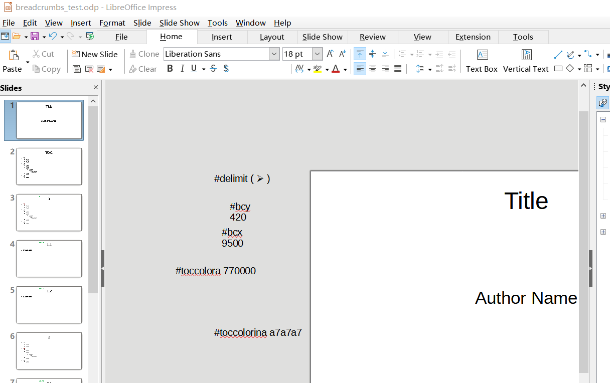

## Automatically Add Breadcrumbs and TOC 

This is a Python macro supporting OpenOffice or LibreOffice Impression presentation documents. It automatically adds breadcrumbs and TOC according to the directive you added in the document.

### Install

Copy breadcrumbs.py to ["where LibreOffice save macros"](https://wiki.documentfoundation.org/Macros/Python_Guide/Introduction#Where_save_macros.3F).

### Usage

First, add directives to pages. Directives are little text boxes containing text with special format. Drag these text boxes outside of visible area of slides to avoid being seen during presentation.



The main things you want to do is "pushing" and "popping" strings (most of the time, title of current page) to and from the current "content hierarchy stack". The breadcrumbs added to pages is generated from current "content hierarchy stack".

```
#toc - The text shape with the biggest area in this page will be filled with TOC. If currently "content hierarchy stack" is not empty, lines in TOC will be set to inactive color, except for the line that matches current stack, which is set to active color.

#push - Push current title (The text shape that is nearest to the top side of this page, except breadcrumbs) into content hierarchy stack.
#push something - Push "something" into content hierarchy stack.
#push something|somethingelse - Push "something" and "somethingelse" into content hierarchy stack.
#pop - Pop the top string from the stack.
#popto n - Pop until only n strings remains in the stack.
#pop n - Pop n strings from the stack.
#poppush
#poppush something|somethingelse
#poppoppush
#poppoppush something
#poppoppoppush
#poppoppoppush something

#hidebc - Don't show breadcrumbs on this page.

# The following directive is recommended to be set as early (e.g. on the first page) as possible.

#bcx 0 - Set x coordinate (millimeters) of the top left corner of breadcrumbs.
#bcy 0 - Set y coordinate (millimeters) of the top left corner of breadcrumbs.
#nodelimit - Do not use a delimiter between breadcrumb elements.
#delimit ( > ) - Use " > " as a delimiter between breadcrumb elements.
#toccolora 111111 - Use "#111111" as the color of currently active title in TOC.
#toccolorina CFCFCF - Use "#CFCFCF" as the color of currently inactive title in TOC.
```

See `breadcrumbs_test.odp` for an example.

Once you finished editing, backup your document first.

Then, run "Run Macro - My Macros - breadcrumbs - automatic_breadcrumbs". Enjoy the result.

Press F11, see "Styles" panel. There will be 2 new drawing styles, "TOC (Auto-generated)" and "Breadcrumb (Auto-generated)". Adjust them to adjust styles of all TOCs and breadcrumbs. Editing text color in "TOC (Auto-generated)" won't work, for the text color of TOC seems to comply with "Outline X" presentation styles.

If you made some change to the content hierarchy of the document, just adjust the directives, backup the document, and run the macro again. TOCs and breadcrumbs are updated.

### Develop

- https://wiki.documentfoundation.org/Macros/Python_Basics
- https://gitlab.com/LibreOfficiant/ide_utils (This is where IDE_utils.py comes from)

### License

IDE_utils.py is copyrighted by its authors and contributors (See the file), licensed under GPLv3. I modified it.

This project is copyrighted by shunf4, licensed under GPLv3.
